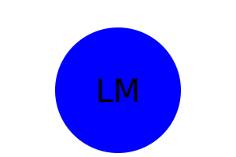

#  SVG Logo Maker

## Table of contents
- Overview
    - The Challenge
    - Screenshot
    - Links
- My Approach
    - Code construction
    - Learnings
- Author
### The Challenge

GIVEN a command-line application that accepts user input
WHEN I am prompted for text
THEN I can enter up to three characters
WHEN I am prompted for the text color
THEN I can enter a color keyword (OR a hexadecimal number)
WHEN I am prompted for a shape
THEN I am presented with a list of shapes to choose from: circle, triangle, and square
WHEN I am prompted for the shape's color
THEN I can enter a color keyword (OR a hexadecimal number)
WHEN I have entered input for all the prompts
THEN an SVG file is created named `logo.svg`
AND the output text "Generated logo.svg" is printed in the command line
WHEN I open the `logo.svg` file in a browser
THEN I am shown a 300x200 pixel image that matches the criteria I entered

## Screenshot

### Links

-GitHUb URL- https://github.com/amalahema/logomaker

## My Approach

### Code construction

- node.js
- package.json
- node_modules
- inquirer
- jest
- SVG 

### Learnings

- Generate a LOGO based on the user input 
- How to handle the promise and call back function
- How to turn the user input collection into an SVG  image  using the write file function
- How to use the class shape and extend its properties to triangle,square & circle
- How to use the render method as the method overriding.
- How to export the class
- How to write unit tests for the  green color triangle and check whether the expected result fail or passed

### Walkthrough Video

       
 

# Author
- Amala Hema , https://github.com/amalahema
